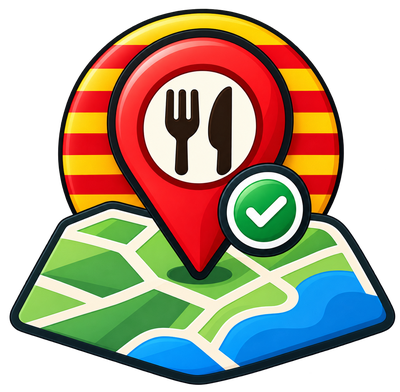

  

  <h1>CuinaCatalanaOSM</h1>

  
Mapa d’establiments amb cuina catalana a OpenStreetMap.

  

    <a href="https://atarom.github.io/CuinaCatalanaOSM/">
      <strong>Obre el mapa ↗</strong>
    </a>
  

---

Consulta els establiments etiquetats amb `cuisine=catalan`, explora els valors de `cuisine` i detecta possibles errors d’etiquetatge.

## Tecnologies i dades

- [MapLibre GL JS](https://maplibre.org/) — renderització del mapa.
- [OpenFreeMap](https://openfreemap.org/) — estil i tessel·les del mapa.
- [Overpass API](https://overpass-api.de/) — consulta de dades d’OpenStreetMap.
- © [OpenStreetMap contributors](https://www.openstreetmap.org/copyright) — dades disponibles sota llicència ODbL.

## Ús

El projecte funciona directament al navegador i no necessita instal·lació.

Pots utilitzar la versió publicada a GitHub Pages:

https://atarom.github.io/CuinaCatalanaOSM/

O clonar el repositori i servir-lo localment amb qualsevol servidor HTTP.
